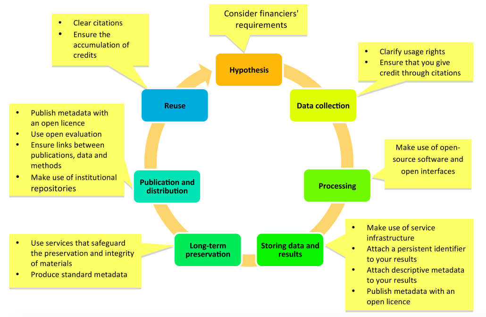
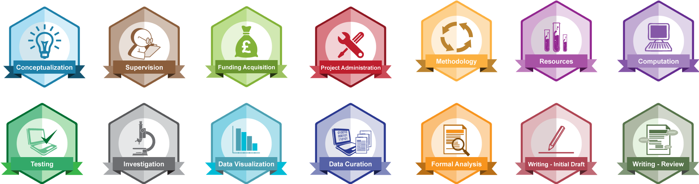

# About research lifecycle

Research is a complex process, and it best understood if broken to phases which are are executed sequentially. There are several representation of research lifecycle, where the most commonly used is one below:

Figure 1. Research lifecyle (source: [FOSTER](https://www.fosteropenscience.eu/node/1420))

<!-- 

  Figure 1. Research lifecyle (source: <a href="https://www.fosteropenscience.eu/node/1420">FOSTER</a>)

 -->

The depicted research lifecycle consists of following phases:

 1. **Hypothesis**

    This the cornerstone phase of research. At this phase of the research lifecycle a researcher establishes a research hypothesis (i.e., a problem statement), selects [research method](https://libguides.newcastle.edu.au/researchmethods) (e.g., [observational study](http://www.psychologyandsociety.com/observationalstudy.html)) which will be used to test/assess the hypothesis and design his/hers research. The design of the research is crucial as it entails details of the phases that will follow, such as a clear design of an experiment/simulation which will be used to test the hypotesis, Data Management Plan ([DMP]((https://dmponline.deic.dk/))) which outlines how data will be collected/processes/published/preserved, etc.

 2. **Data collection**

    At this stage of the research lifecycle a research employs the previously established DMP, thus collecting data either by acquiring already existing datasets ([data re-use](https://nnlm.gov/data/thesaurus/data-reuse)) or creating unexisting datasets (act of data creation).

 3. **Processing**

 4. **Storing data and results**
 5. **Long-term preservation**
 6. **Publication and distribution**
 7. **Reuse**

# Roles in lifecycle

We will use [CRediT](https://casrai.org/credit/) to explain various roles in the research lifecycle. [CRediT](https://casrai.org/credit/) is  high-level taxonomy, including 14 roles, that can be used to represent the roles typically played by contributors to a research output (data, scientific papers, code). The roles describe each contributor’s specific contribution to a research output:

 1. **Conceptualization – Ideas**: formulation or evolution of overarching research goals and aims.
 2. **Data curation**: Management activities to annotate (produce metadata), scrub data and maintain  research data (including software code, where it is necessary for interpreting the data itself) for  initial use and later re-use.
 3. **Formal analysis**: Application of statistical, mathematical, computational, or other formal  techniques to analyze or synthesize study data.
 4. **Funding acquisition**: Acquisition of the financial support for the project leading to this  publication.
 5. **Investigation**: ​Conducting a research and investigation process, specifically performing the  experiments, or data/evidence collection.
 6. **Methodology**: Development or design of methodology; creation of models.
 7. **Project administration**: Management and coordination responsibility for the research activity  - planning and execution.
 8. **Resources**: Provision of study materials, reagents, materials, patients, laboratory samples,  animals, instrumentation, data, computing resources, or other analysis tools.
 9. **Software**: Programming, software development; designing computer programs; implementation of the  - computer code and supporting algorithms; testing of existing code components.
 10. **Supervision**: Oversight and leadership responsibility for the research activity planning and  - execution, including mentorship external to the core team.
 11. **Validation**: Verification, whether as a part of the activity or separate, of the overall replication/ - reproducibility of results/experiments and other research outputs.
 12. **Visualization**: Preparation, creation and/or presentation of the published work, specifically visualization/data presentation.
 13. **Writing – original draft**: ​Preparation, creation and/or presentation of the published work,  - specifically writing the initial draft (including substantive translation).
 14. **Writing – review & editing**: Preparation, creation and/or presentation of the published work by those from the original research group, specifically critical review, commentary or revision including pre- or post-publication stages.

Figure 2. CRedit roles depicted as [OpenBadges](https://openbadges.org/about/) (source: [Github](https://github.com/akenall/Open-Contributorship-Badges/blob/master/Badge%20Files.md))

# About Open Science

# Open Science tools