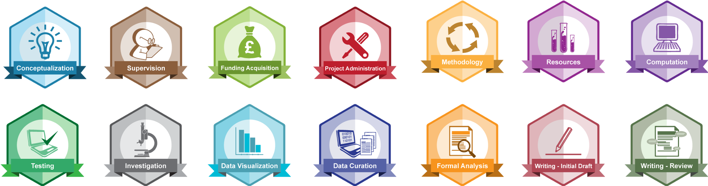

# The research lifecycle

Research is a complex process, and it is most easily understood as a series of steps carried out sequentially in a loop. This loop may repeat one or more times in a project. A commonly-used representation is shown below. 

**Figure 1.** The research lifecyle. From [“The Open Science Handbook”](https://www.fosteropenscience.eu/sites/default/files/pdf/3986.pdf) (Open Science and Research Initiative, 2014). Used under the Creative Commons Attribution 4.0 International Public License.

In reality, some of these phases may run in parallel, for example data collection, processing and storage. 

The depicted research lifecycle consists of the following phases:

 1. **Hypothesis** 

    This the cornerstone phase of research. During this phase of the research lifecycle a researcher establishes a research hypothesis (i.e., a problem statement) and selects a [research method](https://libguides.newcastle.edu.au/researchmethods) (e.g., [observational study](http://www.psychologyandsociety.com/observationalstudy.html)) which will be used to test/assess the hypothesis. 
    
    These steps allow the researcher to further design and plan their research. For example, they might lead to a concept and plans for the experiments or simulation which will be used to test the hypothesis. This in turn allows the researcher to create a Data Management Plan ([DMP]((https://dmponline.deic.dk/))) which outlines how data will be collected, processes, analyzed, published and preserved.

 2. **Data collection** 

    At this phase of the research lifecycle a researcher employs the previously established DMP, thus collecting data either by acquiring already existing ([data re-use](https://nnlm.gov/data/thesaurus/data-reuse)) or creating nonexisting datasets (act of data creation). Also, during this phase any additional information that could be relevant for data processing is collected or create and organized, such as data reports, experiment log books, existing data processing code, etc. As we collect data, we are ingesting relevant [metadata](https://en.wikipedia.org/wiki/Metadata) to data.

 3. **Processing** 

    In this phase of the research lifecycle the collected data are processed to yield information and insights. Also, this phase of the research lifecycle account for all data processing code. For experimental studies, which span over a longer period of time data processing, ideally data processing should run in near-real-time with data collection. It is not uncommon that prior the actual processing a good portion of allocated resources is spent on data preparation (e.g., [data wrangling](https://en.wikipedia.org/wiki/Data_wrangling), filtering, quality control, quality assurance, etc.). According to the study published in [FORBES](https://bit.ly/2WwVPho) data preparation typically accounts for 80% of researcher’s time, whereas the remaining 20% of their time is spend on the actual data processing.For large data collections, it is absolutely a must to annotate them (act of [data annotation](https://zenodo.org/record/3522413)) while processing them as this will assure an efficient [subsetting](https://en.wikipedia.org/wiki/Subsetting) of data collection (i.e., reducing the reported 80% / 20% ratio in future data re-use).

 4. **Storing data and results** 

    This phase actually runs in parallel with [data collection](#data-collection) and [data processing](#data-processing). As we collect data and process data, we need to find and adequate storage for metadata, data, data annotations, data processing code and results of data processing. Typically what we are looking for is a temporarily fast access storage services which will allow a team of researchers to work jointly on data. These services are often offered by local universities. However, researchers can make use of the European collaborative data infrastructures such as [EUDAT](https://www.eudat.eu/) which for example provides this type of services known as [B2Drop](https://www.eudat.eu/services/b2drop).

 5. **Long-term preservation** 

    Typically the university policies guarantee data storage of up to 5 years after the completion of the research project, which basically secures a mid-term preservation of data. For a long-term preservation of data (5+ years), physical tapes and dedicated 'offline' data warehouses are typically used. While on tapes and in warehouses, data are at rest, safely stored and protected from outside influence, accessible on-demand.

 6. **Publication and distribution** 

    Through out the research lifecycle researchers are generating several outputs prior a traditional scientific paper which are publishable, such as data, data processing code, and data annotations. For each research output researcher can either publish only output's metadata or output with metadata. When publishing, a researcher must select an appropriate license which clarifies terms of usage of the publish asset. For metadata, data, and data annotations [Creative Commons licenses](https://creativecommons.org/choose/) are typically used. In case of data processing code various [licenses](https://choosealicense.com/) can be used, where [MIT](https://opensource.org/licenses/MIT) or [BSD](https://opensource.org/licenses/BSD-3-Clause) are among favorites in the open source community. What a research needs to assure is that for the published output a persistent identifier ([PID](https://support.orcid.org/hc/en-us/articles/360006971013-What-are-Persistent-identifiers-PIDs-)) is assigned. This allows an efficient citation of the published output. Typically, Digital Object Identifier ([DOI](https://en.wikipedia.org/wiki/Digital_object_identifier)) is used as a PID for the above mentioned research outputs.

    It is not uncommon to put an [embargo](https://en.wikipedia.org/wiki/Embargo_(academic_publishing)) on a published output, especially data. The embargo is a period during which access to the published output is not allowed to anyone else apart from the output author, however metadata are accessible, and thus the output can be cited.

    If all the outputs, which precede the scientific paper(s) which will use them, are published, the scientific paper(s) can cite them. In this way scientific papers will contain a full chain of custody depicting the entire research lifecycle. Unlike a scientific paper, which content cannot be edited once published, metadata of other research outputs can be edited to point back to the scientific papers which make use of them.

 7. **Reuse** 

    If the previous phases are done meticulously, outputs generated in the research lifecycle will find their use beyond the project lifetime. This will bring higher impact of research, often measured through an increased number of citations.

# Roles in lifecycle

We will use [CRediT](https://casrai.org/credit/) to explain various roles in the research lifecycle. [CRediT](https://casrai.org/credit/) is  high-level taxonomy, including 14 roles, that can be used to represent the roles typically played by contributors in the research lifecycle. The roles describe each contributor’s specific contribution to a research output:

 1. **Conceptualization – Ideas**: formulation or evolution of overarching research goals and aims (see [Hypothesis](#hypothesis) phase).
 2. **Data curation**: Management activities to annotate (produce metadata), scrub data and maintain research data (including software code, where it is necessary for interpreting the data itself) for initial use and later re-use (see [Data collection](#data-collection), [Processing](#data-processing) and [Storage](#data-storing)).
 3. **Formal analysis**: Application of statistical, mathematical, computational, or other formal  techniques to analyze or synthesize study data (see [Processing](#data-processing)).
 4. **Funding acquisition**: Acquisition of the financial support for the project leading to this  publication (see [Hypothesis](#hypothesis) phase).
 5. **Investigation**: ​Conducting a research and investigation process, specifically performing the  experiments, or data/evidence collection (conducting entire research lifecycle).
 6. **Methodology**: Development or design of methodology; creation of models (see [Hypothesis](#hypothesis) phase, especially DMP).
 7. **Project administration**: Management and coordination responsibility for the research activity planning and execution.
 8. **Resources**: Provision of study materials, reagents, materials, patients, laboratory samples,  animals, instrumentation, data, computing resources, or other analysis tools (see [Data collection](#data-collection)).
 9. **Software**: Programming, software development; designing computer programs; implementation of the computer code and supporting algorithms; testing of existing code components (see [Processing](#data-processing)).
 10. **Supervision**: Oversight and leadership responsibility for the research activity planning and execution, including mentorship external to the core team (all phases of the research lifecycle).
 11. **Validation**: Verification, whether as a part of the activity or separate, of the overall replication/reproducibility of results/experiments and other research outputs.
 12. **Visualization**: Preparation, creation and/or presentation of the published work, specifically visualization/data presentation (see [Data processing](#data-processing), [Storage](#data-storing) and [Publishing](#publishing)).
 13. **Writing – original draft**: Preparation, creation and/or presentation of the published work, specifically writing the initial draft (see [Publishing](#publishing)).
 14. **Writing – review & editing**: Preparation, creation and/or presentation of the published work by those from the original research group, specifically critical review, commentary or revision including pre- or post-publication stages (see [Publishing](#publishing)).

**Figure 2.** CRedit roles depicted as [OpenBadges](https://openbadges.org/about/) (source: [Github](https://github.com/akenall/Open-Contributorship-Badges/blob/master/Badge%20Files.md))
