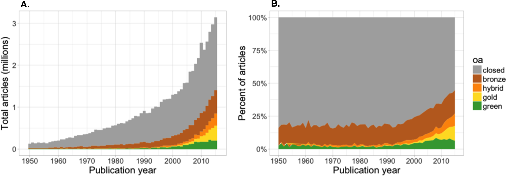

# About Open Science
The following text has been compiled from many sources of which the following where the prime source of information:  Medium article [*What adopting “open science” means for you and your organization*](https://medium.com/@andyclifton_personal/so-you-want-to-implement-open-science-in-an-organisation-d392c2edeb06), FOSTER article [*What is Open Science? Introduction*](https://www.fosteropenscience.eu/node/1420) and presentation [*Setting the default to "open" for research*](https://www.en.inside.aau.dk/Events/Event/talk-on-open-science-by-dr.-jon-tennant--setting-the-default-to--open--for-research.cid427260).

Open science can be seen as a new approach to the scientific process based on cooperative work and new ways of diffusing knowledge by using digital technologies and new collaborative tools. Those in turn lead to reduced costs by reducing wasted duplicate effort, better visibility of results, and more ability to reuse work elsewhere. It also can reduce reliance on key personnel and makes organizations more resilient. The OECD defines Open Science as approach:  “*to make the primary outputs of publicly funded research results – publications and the research data – publicly accessible in digital format with no or minimal restriction*”. However, as stated by the FOSTER](https://www.fosteropenscience.eu/node/1420) project, Open Science is more than that and it is extending the principles of openness to the whole research lifecycle (see figure 1), fostering sharing and collaboration as early as possible thus entailing a systemic change to the way science and research is done.

**Figure 1.** Research lifecyle (source: [FOSTER](https://www.fosteropenscience.eu/node/1420))

Open Science is frequently defined as an umbrella term that involves various movements aiming to remove the barriers for sharing any kind of output, resources, methods or tools, at any stage of the research process. As such, open access to publications, open research data, open source software, open collaboration, open peer review, open notebooks, open educational resources, open monographs, citizen science, or research crowdfunding, fall into the boundaries of Open Science (see figure 2). Even though, especially for the library and information domain, the focus is usually placed on two of these movements: Open Research Data and Open Access to scientific publications.

**Figure 2.** Open Science building blocks (source: [FOSTER](https://www.fosteropenscience.eu/node/1420))

Actually 'Open Science' is not a novelty (recognized by many authors), but according to the [UN declaration](https://www.un.org/en/universal-declaration-human-rights/) it is a (basic) human right (see [Article 27](https://www.un.org/en/universal-declaration-human-rights/)):

1. *Everyone has the right freely to participate in the cultural life of the community, to enjoy the arts and to share in scientific advancement and its benefits.*

2. *Everyone has the right to the protection of the moral and material interests resulting from any scientific, literary or artistic production of which he is the author.*

Therefore, science must be 'open' per se, however pushing and promoting 'Open Science' principles are needed since according to [J. Tennant](https://www.en.inside.aau.dk/Events/Event/talk-on-open-science-by-dr.-jon-tennant--setting-the-default-to--open--for-research.cid427260) there are at least four major crisis:

1. [Access Crisis](https://peerj.com/articles/4375/)

    Most scholarly research remains inaccessible to most people on this planet as shown in the figure below:
    
    **Figure 3.** Number of articles (A) and proportion of articles (B) with OA copies, estimated based on a random sample of 100,000 articles with Crossref DOIs. (source: [H. Piwowar et all 2018​](https://peerj.com/articles/4375/))

2. Reproducibility Crisis

3. Serial Crisis

4. Evaluation Crisis

# Open Science tools