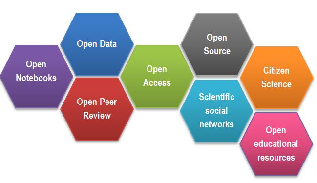
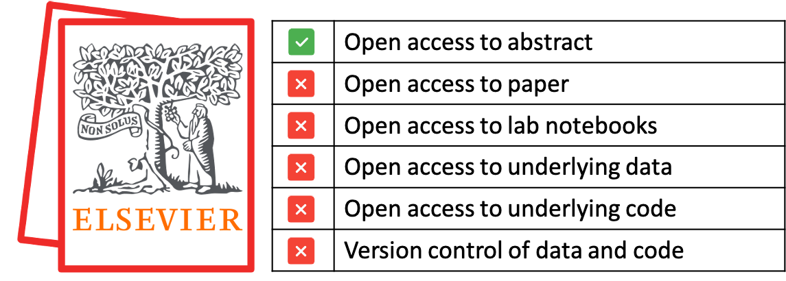

# About Open Science
The following text has been compiled from many sources of which the following where the prime source of information:  Medium article [*What adopting “open science” means for you and your organization*](https://medium.com/@andyclifton_personal/so-you-want-to-implement-open-science-in-an-organisation-d392c2edeb06), FOSTER article [*What is Open Science? Introduction*](https://www.fosteropenscience.eu/node/1420) and presentation [*Setting the default to "open" for research*](https://www.en.inside.aau.dk/Events/Event/talk-on-open-science-by-dr.-jon-tennant--setting-the-default-to--open--for-research.cid427260).

Open science can be seen as a new approach to the scientific process based on cooperative work and new ways of diffusing knowledge by using digital technologies and new collaborative tools. Those in turn lead to reduced costs by reducing wasted duplicate effort, better visibility of results, and more ability to reuse work elsewhere. It also can reduce reliance on key personnel and makes organizations more resilient. The OECD defines Open Science as approach:  “*to make the primary outputs of publicly funded research results – publications and the research data – publicly accessible in digital format with no or minimal restriction*”. However, as stated by the [FOSTER](https://www.fosteropenscience.eu/node/1420) project, Open Science is more than that and it is extending the principles of openness to the whole research lifecycle (see figure 1), fostering sharing and collaboration as early as possible thus entailing a systemic change to the way science and research is done.

**Figure 1.** Research lifecyle (source: [FOSTER](https://www.fosteropenscience.eu/node/1420))

Actually 'Open Science' is not a novelty, but according to the [UN declaration](https://www.un.org/en/universal-declaration-human-rights/) it is a (basic) human right (see [Article 27](https://www.un.org/en/universal-declaration-human-rights/)):

1. *Everyone has the right freely to participate in the cultural life of the community, to enjoy the arts and to share in scientific advancement and its benefits.*

2. *Everyone has the right to the protection of the moral and material interests resulting from any scientific, literary or artistic production of which he is the author.*

Open Science is frequently defined as an umbrella term that involves various movements aiming to remove the barriers for sharing any kind of output, resources, methods or tools, at any stage of the research process. As such, open access to publications, open research data, open source software, open collaboration, open peer review, open notebooks, open educational resources, open monographs, citizen science, or research crowdfunding, fall into the boundaries of Open Science (see figure 2). Even though, especially for the library and information domain, the focus is usually placed on two of these movements: Open Research Data and Open Access to scientific publications. Before we make a deep dive into each of the Open Science building blocks lets review the current state of science.

 
**Figure 2.** Open Science building blocks (source: [FOSTER](https://www.fosteropenscience.eu/node/1420))

Science must be 'open' per se, however pushing and promoting 'Open Science' principles are needed since according to [J. Tennant](https://www.en.inside.aau.dk/Events/Event/talk-on-open-science-by-dr.-jon-tennant--setting-the-default-to--open--for-research.cid427260) there are at least four major crisis:

1. [Access Crisis](https://peerj.com/articles/4375/)

    Most scholarly research remains inaccessible to most people on this planet as shown in the figure below:
     
    **Figure 3.** Number of articles (A) and proportion of articles (B) with OA copies, estimated based on a random sample of 100,000 articles with Crossref DOIs. (source: [H. Piwowar et all 2018​](https://peerj.com/articles/4375/))

2. Reproducibility Crisis

    Much research in many fields cannot be sufficiently reproduced.

3. [Serial Crisis](https://publications.parliament.uk/pa/cm201314/cmselect/cmbis/99/9905.htm)

    Commercial publishers are basically draining our libraries dry. According to the [report](https://publications.parliament.uk/pa/cm201314/cmselect/cmbis/99/9905.htm) subscriptions to journals from commercial publishers is not following the consumer price index, but every year it is becoming significantly higher. Elsevier alone, based on the [article](https://medium.com/@jasonschmitt/can-t-disrupt-this-elsevier-and-the-25-2-billion-dollar-a-year-academic-publishing-business-aa3b9618d40a#.py4oxxqyc) from 2015, makes a profit of 25.2 Billion dollar a year from academic publishing business.

4. [Evaluation Crisis](https://www.ncbi.nlm.nih.gov/pmc/articles/PMC6668985/)

    Globally, Journal Impact Factor (JIF) has been used as a reliable metric to evaluate research articles, their quality. However, JIF was originally designed to aid libraries in deciding which journals to index and purchase for their collections. Therefore, in its structural design JIF is not intended for evaluation of quality of ones work.

As an example lets compare a traditional scientific publishing (e.g., publishing scientific results in one of [Elsevier](https://www.elsevier.com/) journals, Figure 4) and one that incorporates Open Science principles (e.g., publishing in one of [Copernicus](https://publications.copernicus.org/open-access_journals/open_access_journals_a_z.html) journals, Figure 5).

 
**Figure 4.** Traditional scientific practices offer almost no open access to scientific work (source: Elsevier logo - [Wikipedia](https://en.wikipedia.org/wiki/File:Elsevier_logo_2019.svg), check-mark icons - [Flaticons](https://www.flaticon.com/))

In traditional scientific publishing researchers publish scientific paper in high-impact journals which are owned by large publishing companies, which prime drive is profit. These journal have tendency to be closed reviewed (no access to the peer review process) and once a scientific paper is finally accepted and published, there is only a free access to the paper abstract. For the full access to the paper either a reader has to pay (or an entity where the reader works buys a yearly journal subscription) or the author of the paper has to pay an additional (considerable) fee to make his/her work openly available. We could blame large publishing companies for this, however the blame is partially on the authors side as well. The authors have tendency not to share underlying data, neither data processing code nor lab notebooks. There are several reasons for this, that can be summed up with two scenarios that we encounter:
1. It is my data and my code, all work I did is mine!
2. My data are not properly wrangled and enriched for future reuse, my code is a pure chaos, and notebooks are disorganized

The problem with the first scenario is that usually our research work is publicly funded, and thus, it does not belong to us but to everyone. The second scenario is actually a result of decades of maltreating  research outputs other than scientific papers as not important since they are not boosting researchers [*h*-index](https://en.wikipedia.org/wiki/H-index), thus enabling researchers to advance their careers. Simply there was no incentive to make data, code, notebooks, etc. of higher standards other than individual desire to create a long-lasting scientific legacy.

 
**Figure 5.** Open Science practices offer access to all parts of scientific work (source: Copernicus logo  - [Copernicus.org](https://publications.copernicus.org/), checkmark icons - [Flaticons](https://www.flaticon.com/))

As you can see a traditional scientific publishing is more close to an 'advertizement' of one work, while employing 'Open Science' approach you are actually doing science in the right way (basically satisfying many of R5 principles)

<!-- Difference between good science practices and common science practices, i.e. (Open Science vs Advertizement) -->

# Open Science building blocks

## Open Notebooks

## Open Data

## Open Peer Review

## Open Access

## Open Source

## Scientific social networks

## Citizen Science

## Open educational resources