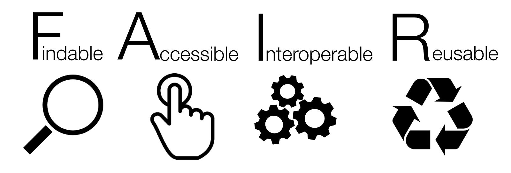

# Introduction


Researchers spend most of their time preparing data for analysis instead of doing the analysis. A recent survey, reported by [Forbes](https://bit.ly/2WwVPho), showed that collecting, organizing, and cleaning data  (i.e., data preparation) accounts for 80% of researcher’s time, whereas the remaining 20% of their time is spend on the actual data analysis. Also the same survey indicated that 76% of researchers stated that the data preparation is the least favorable part of their work, which in effect maintains the state of "circulus vitiosus" where the legacy (e.g., data, code, etc.) of those who create or use data has a poor reusability. One of potential reasons for flagging the data preparation as the least favorable work is that this type of work is usually considered as engineering, thus not science. Therefore, data creators often do not receive a proper scientific recognition for their work.

We can look at this issue from another perspective. The amount of data we create is exponentially growing. In the past, those who created data were at the same analyzing them (almost) to the full extent. This resulted in the situation in which researchers who created data were selecting formats they were accustomed to, while omitting data description or not having a consistent approach in describing data since they were at the same time users of their own product. In the modern age, the amount of data is so large that those who create them can manage to analyze only a fraction of the entire dataset, where the remaining amount is left in ideal to be analyzed by other researchers.

To break the vicious circle it became evident and essential to establish and comply to certain guiding principles for data management and stewardship, divided the roles of data creators and data users in data lifecycle, and provide a proper scientific recognition to data creators. With respect to the data management and stewardship the [FAIR principles](https://www.nature.com/articles/sdata201618) represent the guiding principles initially endorsed by the [European Commission](https://ec.europa.eu/research/participants/data/ref/h2020/grants_manual/hi/oa_pilot/h2020-hi-oa-data-mgt_en.pdf) (EC) and now globally pursued. The FAIR principles stand for making data **F**indable, **A**ccessible, **I**nteroperable and **R**eusable (FAIR) by humans and but even more importantly by **machines**. In the following sections we will review each principle individually. To large extent the material for the sections is compiled from [GO FAIR](https://www.go-fair.org/) web site (material permitted for reuse under [CC BY 4.0](https://creativecommons.org/licenses/by/4.0/) license).


**Figure 1.** FAIR principles (source: [Sangya Pundir, Wikipedia](https://commons.wikimedia.org/w/index.php?title=User:SangyaPundir&action=edit&redlink=1) license [CC BY SA](https://creativecommons.org/licenses/by-sa/4.0/deed.en))

<!-- > _Data_ means anything that contains some kind of information. One could apply the FAIR principles to anything from a text document to an e-mail to a lidar data set to code. In general, though, because they are the most valuable type of data (i.e. the hardest to recreate), we usually think of data as meaning a classical data set obtained from a measurement or simulation. -->

# F - Findable
The first step in (re)using data is to find them. Metadata and data should be easy to find for both humans and computers. Machine-readable metadata are essential for automatic discovery of datasets and services, so this is an essential component of the [FAIRification](https://www.go-fair.org/fair-principles/fairification-process/) process. Under the **Findable** facet of the FAIR principles we have four principles:

```
F1. Metadata and data are assigned a globally unique and persistent identifier (PID)
```
Principle **F1** is arguably the most important because it will be hard to achieve other aspects of FAIR without globally unique and persistent identifiers. Globally unique and persistent identifiers remove ambiguity in the meaning of your published data. They are typically resolve to a web page. Examples of unique and persistent identifiers are:

- Each registered researcher in [ORCID](https://orcid.org/) has a unique ORCID iD, for example id [https://orcid.org/0000-0002-9381-9693](https://orcid.org/0000-0002-9381-9693) resolve to a specific person in the ORCID data base
- Identifier [http://vocab.nerc.ac.uk/collection/A01/](http://vocab.nerc.ac.uk/collection/A01/) resolves to the  thesaurus of terms used at all hierarchical levels in the International Coastal Atlas Network
- DOI [10.11583/DTU.12005421.v1](https://doi.org/10.11583/DTU.12005421.v1) resolves to landing page containing metadata of large eddy simulation of wake flow behind 2.3 MW wind turbine

```
F2. Data are described with rich metadata (further defined by R1 principle below)
```
**F2** advocates for providing generous and extensive metadata while creating FAIR digital resources. Metadata should include descriptive information about the context, quality and condition, or characteristics of the data. Rich metadata allow a computer to automatically accomplish routine and tedious sorting and prioritizing tasks that currently demand a lot of attention from researchers. The rationale behind this principle is that someone should be able to find data based on the information provided by their metadata, even without the data’s identifier. As such, compliance with F2 helps people to locate your data, and increase re-use and citations. Rich metadata implies that you should not presume that you know who will want to use your data, or for what purpose. The bottom line, there is no useless metadata.

```
F3. Metadata clearly and explicitly include the identifier of the data they describe
```
The metadata and the dataset they describe are usually separate files. Therefore, the principle **F3** requires that the association between a metadata file and the dataset should be made explicit by mentioning a dataset’s globally unique and persistent identifier in the metadata. If we consider the example of [LES dataset](https://doi.org/10.11583/DTU.12005421.v1), its metadata has DOI (PID) but also metadata contains PIDs to the dataset, which in this example are resolvable download links of files which make the dataset.

```
F4. Metadata and data are registered or indexed in a searchable resource
```

Identifiers and rich metadata descriptions alone will not ensure ‘findability’ on the Internet. Perfectly good data resources may go unused simply because no one knows they exist. If the availability of a digital resource such as a dataset, service or repository is not known, then nobody (and no machine) can discover it. There are many ways in which digital resources can be made discoverable, including indexing. For example, Google sends out spiders that ‘read’ web pages and automatically index them, so they then become findable in the Google search box. This is great for most ordinary searchers, but for scholarly research data, we need to be more explicit about indexing. Principles F1-F3 will provide the core elements for fine-grained indexing by some current repositories and future services (e.g., Google is developing a [specific dataset search service](https://datasetsearch.research.google.com/)).

# A - Accessible
Once the user finds the required data, she/he needs to know how can they be accessed, possibly including authentication and authorization. Here we have two principle, where one of them is further decoupled to two sub-principles:
```
A1. Metadata and data are retrievable by their identifier using a standardized communications protocol.
```
Most users of the internet retrieve data by ‘clicking on a link’. This is a high-level interface to a low-level protocol called tcp, that the computer executes to load data in the user’s web browser. (Note that http(s) or ftp, which form the backbone of modern internet, are built on tcp, and make requesting and providing digital resources substantially easier than other communication protocols.) Principle A1 states that FAIR data retrieval should be mediated without specialized or proprietary  tools or communication methods. This principle focuses on how data and metadata can be retrieved from their identifiers.

```
A1.1 The protocol is open, free, and universally implementable
```
To maximize data reuse, the protocol should be free (no-cost) and open (-sourced) and thus globally implementable to facilitate data retrieval. Anyone with a computer and an internet connection can access at least the metadata (e.g., HTTP, FTP, SMTP). Hence, this criterion will impact your choice of the repository where you will share your data.

```
A1.2 The protocol allows for an authentication and authorization procedure, where necessary
```
This is a key, but often misunderstood, element of FAIR. The ‘A’ in FAIR does not necessarily mean ‘open’ or ‘free’. Rather, it implies that one should provide the exact conditions under which the data are accessible. Hence, even heavily protected and private data can be FAIR. Ideally, accessibility is specified in such a way that a machine can automatically understand the requirements, and then either automatically execute the requirements or alert the user to the requirements. It often makes sense to request users to create a user account for a repository. This allows to authenticate the owner (or contributor) of each dataset, and to potentially set user-specific rights. Hence, this criterion will also affect your choice of the repository where you will share your data. Typical example of protocols which has options for authentication are HTTPS and FTPS.

```
A2. Metadata are accessible, even when the data are no longer available
```
Datasets tend to degrade or disappear over time because there is a cost to maintaining an online presence for data resources. When this happens, links become invalid and users waste time hunting for data that might no longer be there. Storing the metadata generally is much easier and cheaper. Hence, principle A2 states that metadata should persist even when the data are no longer sustained. A2 is related to the registration and indexing issues described in F4.

# I - Interoperable
The data usually need to be integrated with other data. In addition, the data need to interoperate with applications or workflows for analysis, storage, and processing.

> I1. Metadata and data use a formal, accessible, shared, and broadly applicable language for knowledge representation

> I2. Metadata and data use vocabularies that follow FAIR principles

> I3. Metadata and data include qualified references to other Metadata and data


# R - Reusable
The ultimate goal of FAIR is to optimise the reuse of data. To achieve this, metadata and data should be well-described so that they can be replicated and/or combined in different settings.

> R1. Metadata and data are richly described with a plurality of accurate and relevant attributes
>> R1.1. Metadata and data are released with a clear and accessible data usage license<br><br>
>> R1.2. Metadata and data are associated with detailed provenance<br><br>
>> R1.3. Metadata and data meet domain-relevant community standards