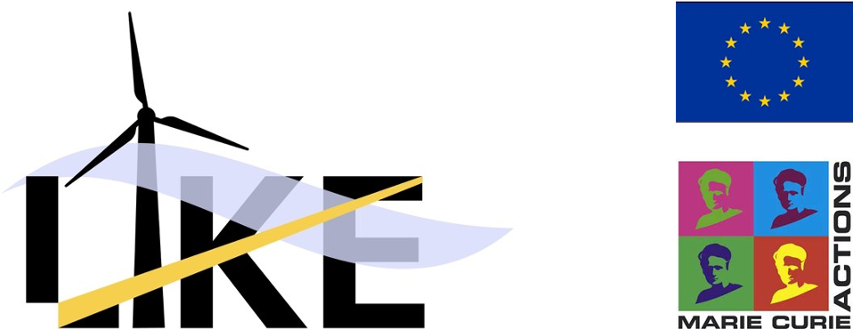

## About LIKE project

**LI**dar **K**nowledge **E**urope ([LIKE](https://www.msca-like.eu/)) fosters training and education of young researchers on emerging laser-based wind measurement technologies and their translation into industrial applications.

Doppler Lidars (light detection and ranging) that measure the wind in the atmosphere remotely have reduced in price and increased in reliability over the last decade mainly done by European universities and companies serving the growing wind energy industry. This opens the possibility for new applications in many areas.

LIKE improves, tests and refines the technology thus expanding these areas of application. LIKE promotes wind energy applications such as wind resource mapping using scanning lidars and control of single wind turbines or entire wind farms in order to increase energy production and reduce mechanical loads.

LIKE maps unusual atmospheric flow patterns over airports in real-time and thus improves the safety of landing aircrafts. LIKE explores wind and turbulence under extreme conditions at the sites of future European bridges paving the road for optimal bridge design. LIKE trains 15 [Early Stage Researchers](http://www.oncornet.eu/index.php/recruitment/2-uncategorised/79-esr) (ESRs) to an outstanding level at European academic institutions and industrial companies, thus forming strong interdisciplinary relations between industry and technical sciences.

These relations are implemented through employment of the ESRs at academia as well as industry, and through intersectoral secondments.
